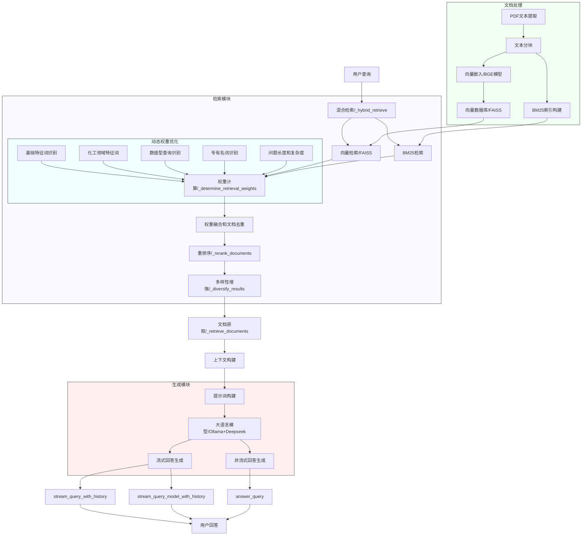
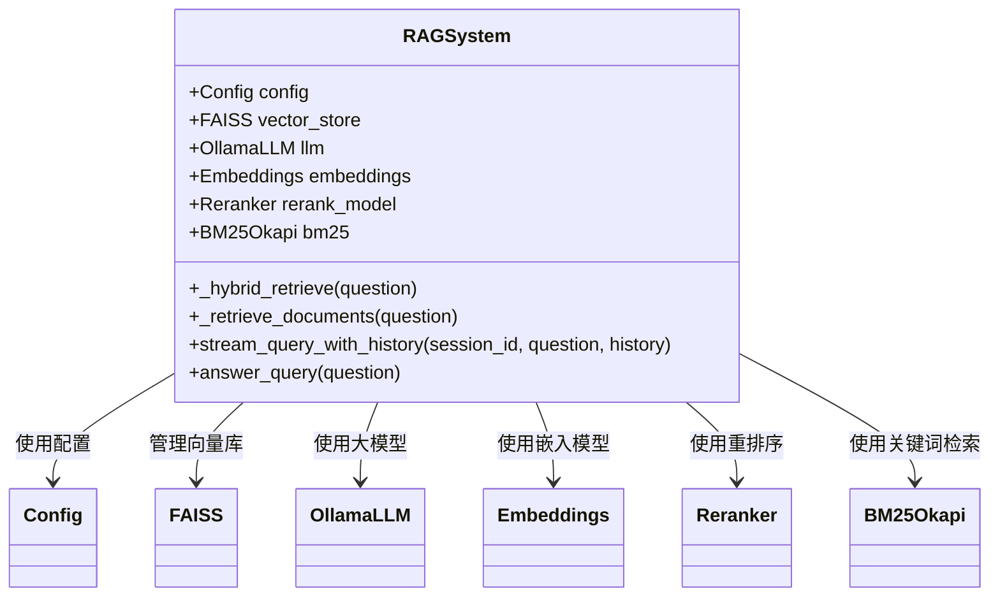

# 化工安全AI助手系统

化工安全AI助手系统是一个综合性的安全知识管理与智能问答平台，旨在提供化工行业安全相关的知识检索、问答服务和安全管理功能。系统由化工RAG(Retrieval-Augmented Generation)模块和化工AI应用模块组成。

## 系统架构

系统由以下主要部分组成：

1. **前端应用**：基于现代Web技术开发的用户界面，提供对话交互、知识浏览和管理功能。

2. **后端服务**：
   - `chemical_rag`模块：提供知识检索增强生成服务，处理用户查询并结合知识库内容生成回答
   - `chemical_ai`模块：提供用户界面和交互功能，包括用户管理、会话管理、反馈收集等

3. **数据库**：
   - MySQL数据库存储用户数据、会话历史、知识库索引、反馈信息等

## RAG系统工作流程

RAG（检索增强生成）系统是本项目的核心组件，它通过结合检索技术和生成式AI，为用户提供准确的化工安全领域信息。以下是RAG系统的工作流程图：

### 流程图



### 处理流程详解

1. **文档处理阶段**
   - PDF文本提取与分块
   - 向量嵌入（使用BGE-Large模型）
   - 向量数据库（FAISS）和BM25索引构建

2. **检索阶段**
   - **混合检索策略**：结合向量检索和BM25检索
   - **动态权重优化**：
     - 基础特征词识别（事实型vs概念型）
     - 化工领域特征词权重调整
     - 数值型查询与专有名词识别
     - 根据问题长度和复杂度优化权重
   - **文档去重与权重融合**
   - 结果重排序和多样性增强

3. **生成阶段**
   - 结构化上下文构建
   - 专业提示词设计
   - 使用Ollama+Deepseek模型生成回答（支持流式和非流式）

4. **多轮对话支持**
   - 会话历史管理
   - 上下文感知提示构建

5. **错误处理机制**
   - 检索失败的回退策略
   - 模型生成异常处理

### 组件关系图



## 安装与部署

### 系统要求

- Python 3.8+
- MySQL 8.0+
- Node.js 14+

### 安装步骤

1. **克隆项目**

```bash
git clone https://github.com/your-repository/chemical-safety-ai-assistant.git
cd chemical-safety-ai-assistant
```

2. **设置前端环境**

```bash
cd chemical_ai
npm install
```

3. **设置后端环境**

```bash
cd chemical_rag
pip install -r requirements.txt
```

4. **数据库设置**

执行数据库脚本创建所需表结构：

```bash
mysql -u [用户名] -p [数据库名] < chemical_ai/chemical_server.sql
```

5. **配置文件设置**

复制并编辑配置文件模板：

```bash
cp chemical_rag/config.example.py chemical_rag/config.py
# 编辑配置文件，设置数据库连接信息和其他参数
```

## 运行系统

1. **使用快速启动脚本**

Windows用户:
```bash
# 双击start_server.bat文件
# 或在命令行中运行
start_server.bat
```

Linux/Mac用户:
```bash
# 赋予脚本执行权限
chmod +x start_server.sh
# 运行脚本
./start_server.sh
```

2. **手动启动服务**

```bash
cd chemical_rag
python main.py
```

2. **启动前端应用**

```bash
cd chemical_ai
npm run dev
```

3. **访问系统**

打开浏览器访问：`http://localhost:3000`

## 系统功能概述

1. **智能问答**：用户可以通过对话界面向系统提问化工安全相关问题，系统会根据知识库内容提供专业回答。

2. **多轮对话**：系统新增支持多轮连续对话功能，能够记住对话历史并理解上下文，使交互更自然流畅。
   - 自动会话管理和维护
   - 上下文相关的回答生成
   - 智能会话过期机制
   - 详细功能说明请参考 [多轮对话功能文档](chemical_rag/README_CONVERSATION.md)

3. **知识管理**：
   - 支持知识文档的上传、分类、检索
   - 提供危险化学品MSDS信息库
   - 包含应急处理预案库

4. **用户管理**：
   - 用户注册、登录、个人设置
   - 会话历史记录管理

5. **反馈系统**：
   - 支持用户对系统功能和AI回答内容进行反馈
   - 管理员可处理和回复用户反馈

6. **管理后台**：
   - 仪表盘展示系统运行状态和关键指标
   - 用户活动监控和管理
   - 知识库内容管理

## 错误排查

如果遇到以下问题，请尝试相应的解决方案：

1. **数据库连接错误**：检查配置文件中的数据库连接参数是否正确。

2. **字符集冲突**：系统使用了utf8mb4字符集，如果遇到字符集相关错误，请检查数据库表的字符集设置。

3. **端口占用**：如果端口被占用，可以在配置文件中修改端口号。

4. **401认证错误**：遇到"无效的token"或认证失败的情况:
   - 检查localStorage中是否存在有效token（打开浏览器开发者工具 -> Application -> Local Storage）
   - 如果token已过期或无效，请重新登录系统
   - 确保数据库中的token记录未过期且is_valid=1
   - 后端日志中会记录详细的token验证失败原因

## 用户认证与会话管理

系统使用基于Token的认证机制，工作流程如下：

1. **登录流程**：
   - 用户提交账号密码（或手机验证码）登录
   - 服务器验证成功后生成token并存储到数据库
   - 前端接收token并保存到localStorage

2. **认证机制**：
   - 所有需要认证的API请求都在Header中携带`Authorization: Bearer <token>`
   - 后端中间件验证token的有效性和过期时间
   - 认证失败时返回401状态码

3. **Token管理**：
   - token默认有效期为1天
   - 用户主动登出时会使当前token失效
   - 管理员可在后台查看和管理活跃token

4. **常见问题**：
   - 如遇到频繁登录失效，检查token有效期设置
   - 多设备登录可能导致旧token失效
   - 清除浏览器缓存会导致token丢失，需要重新登录

## 联系与支持

如有问题或需要支持，请联系系统管理员或发送邮件至：support@example.com 

## 如何贡献

我们非常欢迎社区贡献，无论是修复错误、改进功能还是添加新功能。以下是贡献流程：

1. Fork 本仓库
2. 创建你的特性分支 (`git checkout -b feature/amazing-feature`)
3. 提交你的更改 (`git commit -m 'Add some amazing feature'`)
4. 推送到分支 (`git push origin feature/amazing-feature`)
5. 创建一个新的Pull Request

## 代码结构

```
chemical/
│
├── chemical_rag/        # RAG (检索增强生成) 模块
│   ├── data/            # 知识库数据
│   ├── routers/         # API路由
│   ├── rag_system.py    # RAG核心系统
│   └── ...
│
├── chemical_ai/         # 前端应用和用户界面
│   ├── src/             # 源代码
│   ├── public/          # 静态资源
│   └── ...
│
└── chemical_server.sql  # 数据库结构
```

## 版本历史

查看 [发布历史](https://github.com/用户名/chemical/releases)

## 许可证

本项目采用 MIT 许可证 